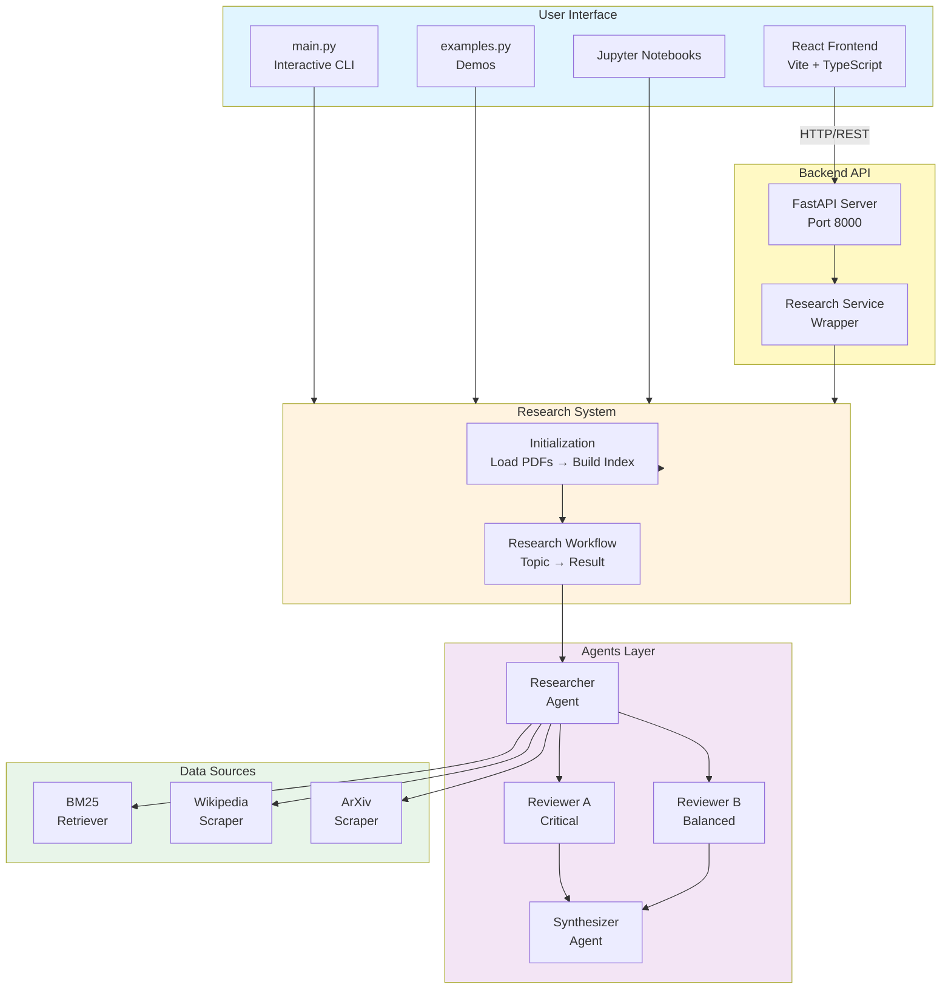
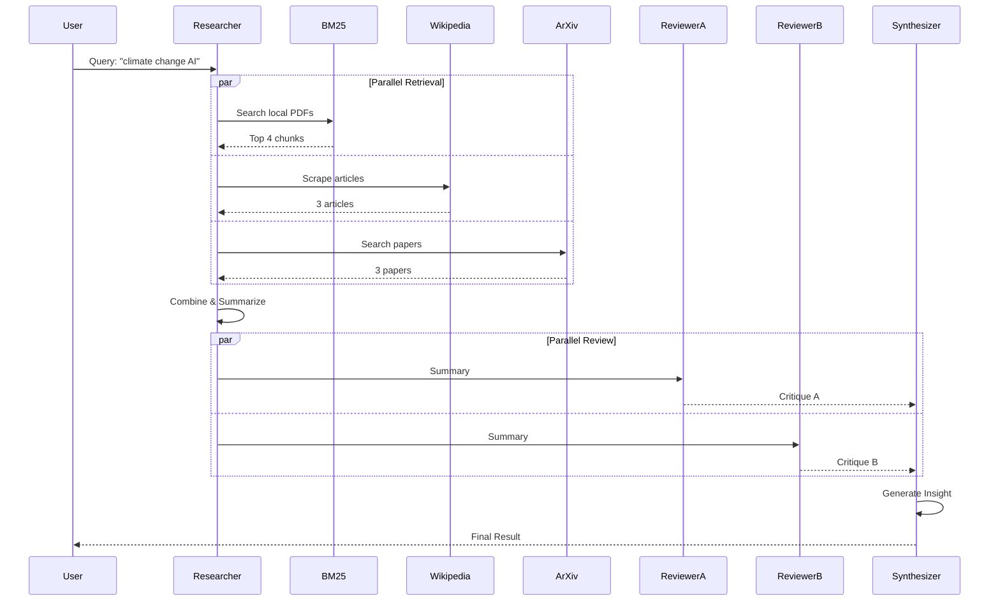
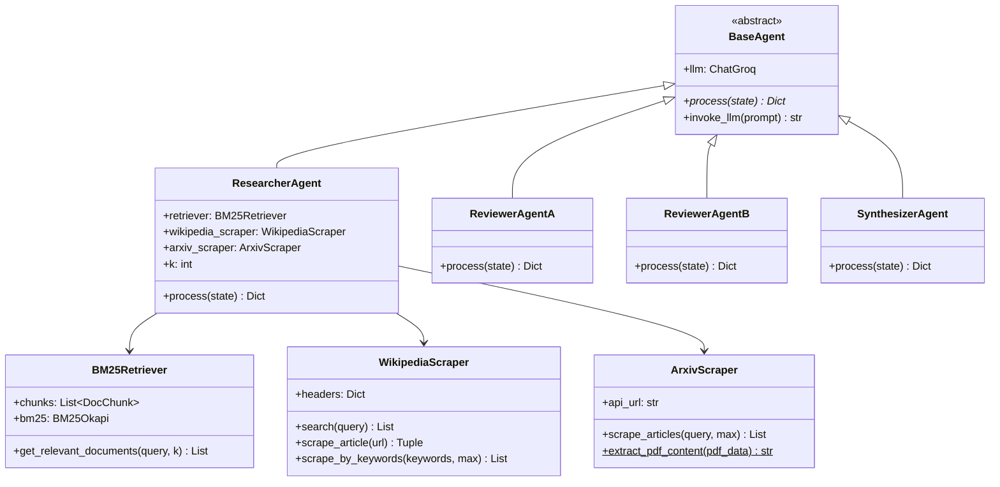
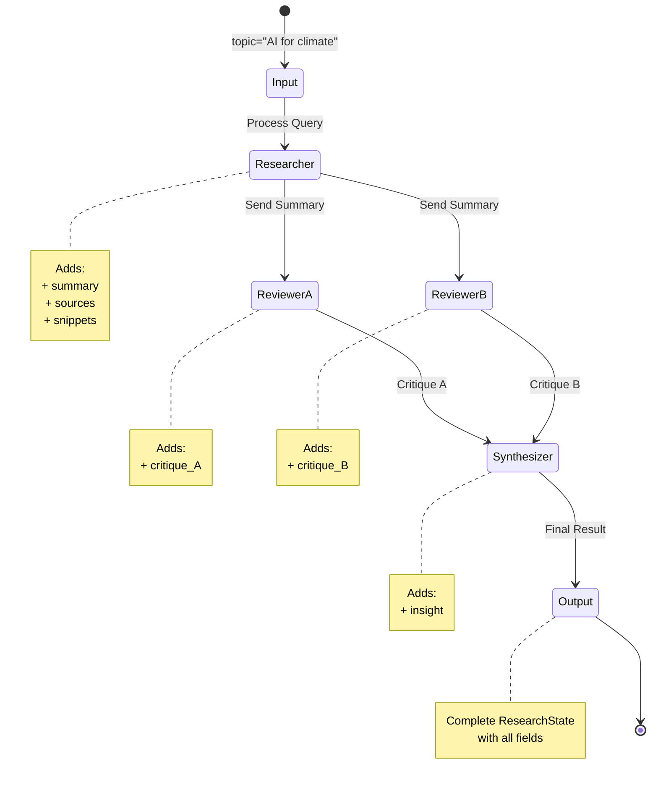
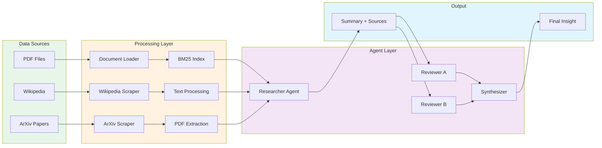
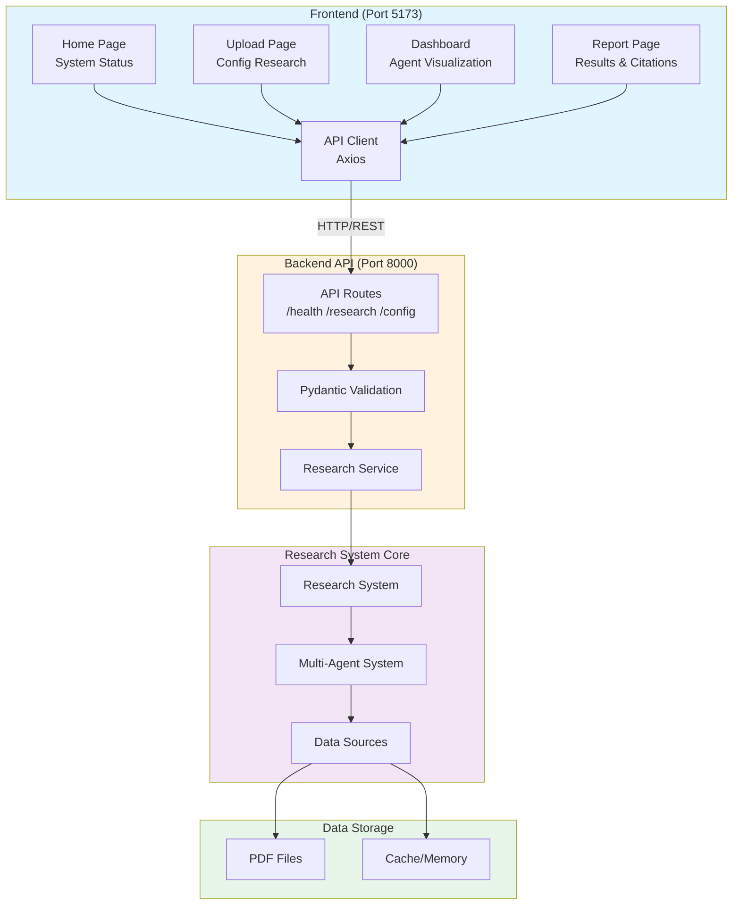
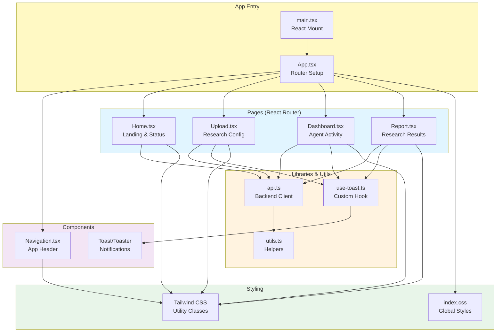
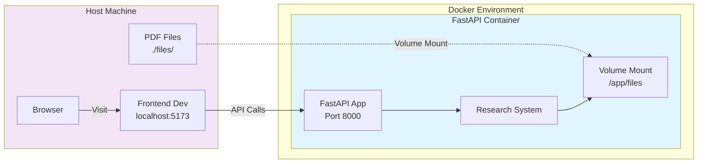
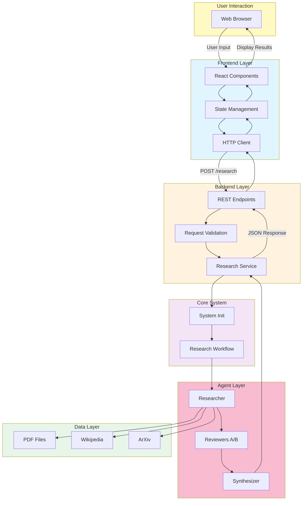

# Architecture Diagrams (Mermaid)

## 📑 Table of Contents

- [High-Level System Overview](#high-level-system-overview)
- [Component Interaction Flow](#component-interaction-flow)
- [Class Hierarchy](#class-hierarchy)
- [State Flow](#state-flow)
- [Data Flow](#data-flow)
- [Full Stack Architecture](#full-stack-architecture)
- [Frontend Architecture](#frontend-architecture)
- [Docker Deployment](#docker-deployment)
- [Development Workflow](#development-workflow)
- [Data Flow (Complete System)](#data-flow-complete-system)


## High-Level System Overview



## Component Interaction Flow



## Class Hierarchy



## State Flow



## Data Flow



## Full Stack Architecture



## Frontend Architecture



## Docker Deployment



## Development Workflow

```mermaid
sequenceDiagram
    participant Dev as Developer
    participant FE as Frontend (Vite)
    participant BE as Backend (FastAPI)
    participant RS as Research System
    participant EXT as External APIs

    Dev->>FE: npm run dev
    Note over FE: Starts on :5173<br/>Hot Module Reload
    
    Dev->>BE: python -m backend.run
    Note over BE: Starts on :8000<br/>Auto-reload enabled
    
    Dev->>FE: Opens http://localhost:5173
    FE->>FE: Loads React App
    
    FE->>BE: GET /health
    BE-->>FE: {"status": "healthy"}
    
    Dev->>FE: Configures research topic
    FE->>BE: POST /research
    BE->>RS: Initialize research
    RS->>EXT: Scrape Wikipedia/ArXiv
    EXT-->>RS: External data
    RS->>RS: Multi-agent processing
    RS-->>BE: Research result
    BE-->>FE: JSON response
    FE->>FE: Render results
    FE-->>Dev: Display report

    style Dev fill:#fff9c4
    style FE fill:#e1f5ff
    style BE fill:#fff3e0
    style RS fill:#f3e5f5
    style EXT fill:#e8f5e9
```

## Data Flow (Complete System)

