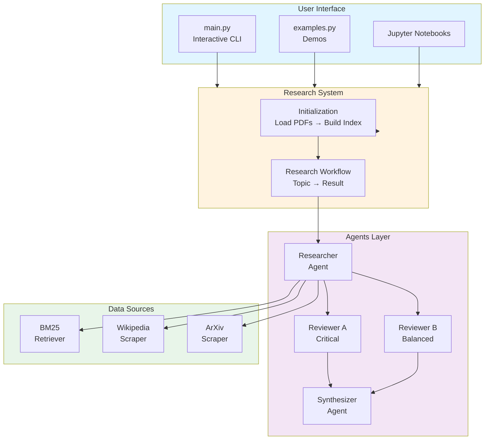
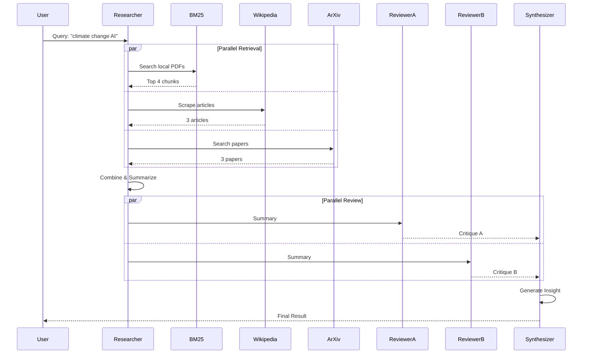
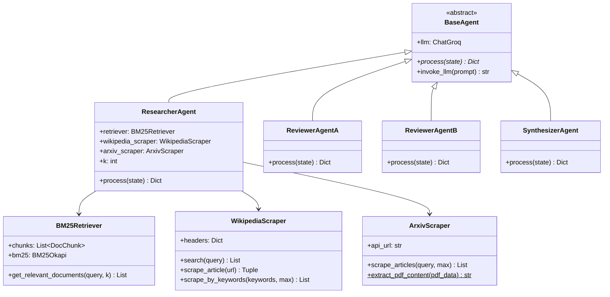
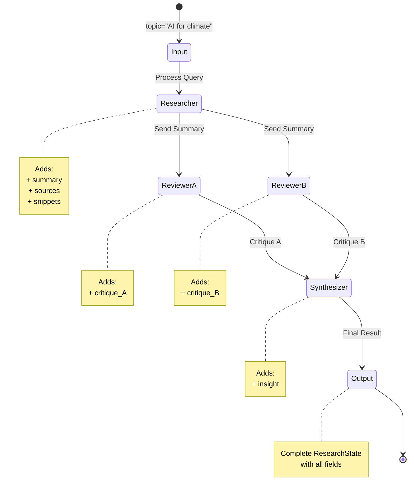
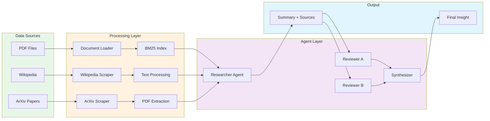
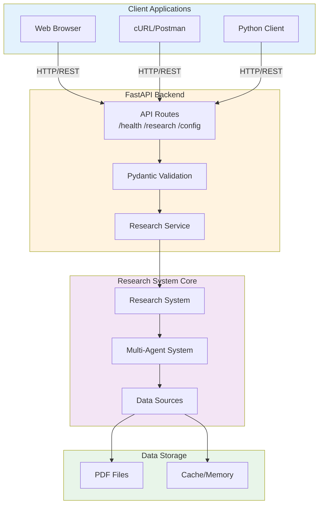
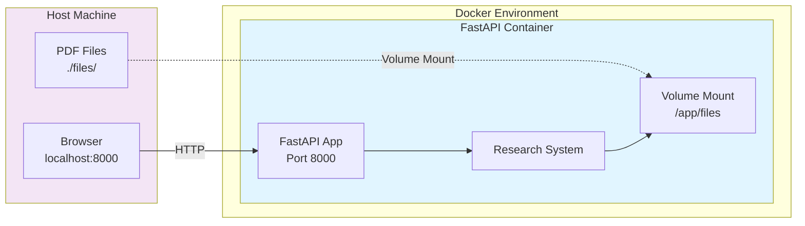

# Architecture Diagrams (Mermaid)

## High-Level System Overview

## Component Interaction Flow

## Class Hierarchy

## State Flow

## Data Flow

## Backend Architecture

## Docker Deployment

