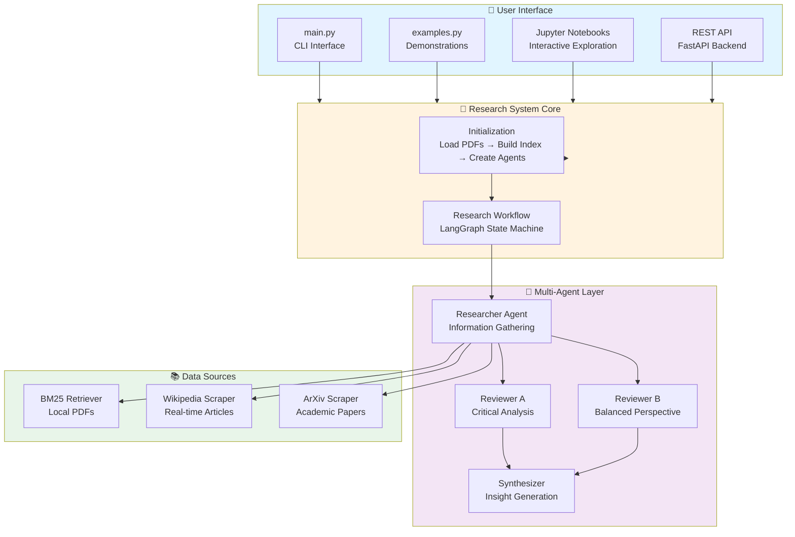
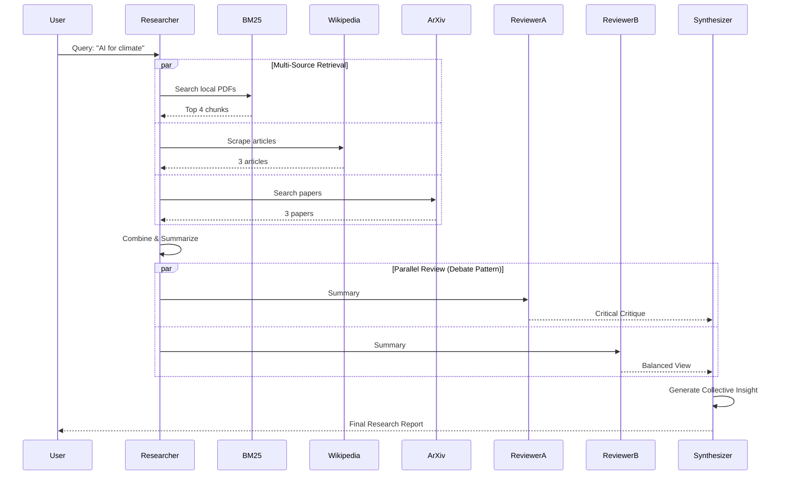
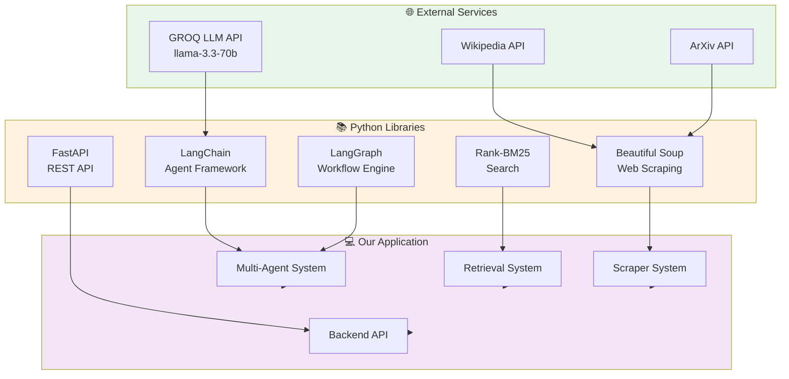

<div align="center">
  
  
  # 🤖 Multi-Agent Research Assistant
  
  **Agentic AI for Accelerated Research**
  
  [](https://www.python.org/downloads/)
  [](https://opensource.org/licenses/MIT)
  [](https://fastapi.tiangolo.com/)
  [](https://github.com/langchain-ai/langgraph)
</div>

---

A sophisticated AI-powered research system that combines **BM25 document retrieval**, **Wikipedia scraping**, **ArXiv integration**, and **multi-agent debate patterns** using LangGraph for comprehensive topic analysis.

## 📚 Documentation

- 🔧 **[API Documentation](API.md)** - Complete API reference
- 📁 **[Project Structure](PROJECT_STRUCTURE.md)** - Detailed folder structure overview
- 🏗️ **[Architecture](ARCHITECTURE.md)** - Detailed architecture, agents and design patterns
- 🎨 **[Architecture Diagrams](ARCHITECTURE_DIAGRAMS.md)** - Visual system diagrams (Mermaid)
- 📐 **[LaTeX Diagrams](diagrams/README.md)** - Professional LaTeX/TikZ diagrams
- 🤝 **[Summary](SUMMARY.md)** - Project summary and achievements
- 🔑 **[API Key Setup](API_KEY_SETUP.md)** - Step-by-step API configuration guide
- 🌐 **[Backend Documentation](backend/README.md)** - FastAPI backend setup and usage

## 🌟 Features

### Core Capabilities

- ✅ **Multi-Source Research**: Combines PDF documents, Wikipedia articles, and ArXiv papers
- ✅ **BM25 Retrieval**: Fast lexical search over document corpus with configurable ranking
- ✅ **Multi-Agent Debate**: Three-agent system (Researcher → 2 Reviewers → Synthesizer) for balanced insights
- ✅ **ArXiv Integration**: Scrape academic papers with PDF content extraction (no saving required)
- ✅ **Wikipedia Scraping**: Real-time article retrieval with intelligent query cleaning
- ✅ **REST API Backend**: Production-ready FastAPI server with Docker support
- ✅ **Modular Architecture**: Clean, class-based design following SOLID principles

### Advanced Features

- 🔄 **LangGraph Orchestration**: State-based multi-agent workflow management
- 🎯 **Configurable Source Limits**: Control Wikipedia articles and ArXiv papers per query
- 📊 **Comprehensive State Management**: Track all research stages with typed state objects
- 🐳 **Docker Ready**: Containerized backend with docker-compose support
- 🔌 **Flexible Integration**: Use as library, CLI, or REST API
- 📈 **Token Optimization**: Configurable snippet lengths and model selection

## 🏗️ System Architecture

### High-Level Overview



### Research Workflow



**📖 See full architecture:** [ARCHITECTURE_DIAGRAMS.md](ARCHITECTURE_DIAGRAMS.md)

## 📁 Project Structure

```
mit_hackathon/
├── 📄 Core Files
│   ├── main.py                      # Main CLI entry point
│   ├── examples.py                  # Usage demonstrations
│   ├── README.md                    # This file
│   ├── requirements.txt             # Python dependencies
│   ├── .gitignore                   # Git ignore rules
│   └── .env.example                 # Environment variables template
│
├── 📚 Documentation
│   ├── API.md                       # API reference
│   ├── API_KEY_SETUP.md            # API key configuration guide
│   ├── ARCHITECTURE.md              # System architecture (detailed)
│   ├── ARCHITECTURE_DIAGRAMS.md     # Visual diagrams (Mermaid)
│   ├── PROJECT_STRUCTURE.md         # Folder structure
│   ├── SUMMARY.md                   # Project summary
│   └── BACKEND_*.md                 # Backend documentation
│
├── 🎨 Diagrams
│   ├── diagrams/
│   │   ├── architecture_diagrams.tex   # LaTeX/TikZ diagrams
│   │   ├── compile_diagrams.bat        # Windows compiler
│   │   ├── compile_diagrams.sh         # Linux/Mac compiler
│   │   └── README.md                   # Diagrams documentation
│   └── image/
│       └── logo.jpg                    # Project logo
│
├── 🌐 Backend (FastAPI)
│   ├── backend/
│   │   ├── app.py                   # FastAPI application
│   │   ├── config.py                # Backend configuration
│   │   ├── research_service.py      # Research service wrapper
│   │   ├── run.py                   # Server runner
│   │   ├── requirements.txt         # Backend dependencies
│   │   ├── README.md                # Backend docs
│   │   ├── Dockerfile               # Docker configuration
│   │   ├── docker-compose.yml       # Docker Compose setup
│   │   └── .env.example             # Backend environment vars
│
├── 💻 Frontend (React + TypeScript)
│   ├── frontend/
│   │   ├── src/
│   │   │   ├── App.tsx              # Main app component
│   │   │   ├── main.tsx             # Entry point
│   │   │   ├── components/          # Reusable components
│   │   │   │   ├── Navigation.tsx   # Navigation bar
│   │   │   │   └── ui/              # UI components
│   │   │   ├── pages/               # Page components
│   │   │   │   ├── Home.tsx         # Landing page
│   │   │   │   ├── Upload.tsx       # Research configuration
│   │   │   │   ├── Dashboard.tsx    # Agent visualization
│   │   │   │   └── Report.tsx       # Research results
│   │   │   ├── hooks/               # Custom React hooks
│   │   │   └── lib/                 # Utilities & API client
│   │   ├── index.html               # HTML template
│   │   ├── package.json             # Node dependencies
│   │   ├── vite.config.ts           # Vite configuration
│   │   ├── tailwind.config.js       # Tailwind CSS config
│   │   ├── README.md                # Frontend docs
│   │   └── .env.example             # Frontend environment vars
│
├── 🧩 Source Code
│   ├── src/
│   │   ├── config.py                # Global configuration
│   │   ├── research_system.py       # Main orchestrator
│   │   ├── agents/
│   │   │   ├── base_agent.py       # Abstract base agent
│   │   │   ├── researcher_agent.py # Research & gathering
│   │   │   ├── reviewer_agent.py   # Critical analysis (A & B)
│   │   │   ├── synthesizer_agent.py# Insight synthesis
│   │   │   └── state.py            # Shared state schema
│   │   ├── retrievers/
│   │   │   ├── bm25_retriever.py   # BM25 search engine
│   │   │   └── document_loader.py  # PDF loading & chunking
│   │   ├── scrapers/
│   │   │   ├── wikipedia_scraper.py# Wikipedia API integration
│   │   │   └── arxiv_scraper.py    # ArXiv paper scraping
│   │   └── utils/
│   │       ├── tokenizer.py        # Text tokenization
│   │       └── text_utils.py       # Text processing utilities
│
├── 📓 Notebooks
│   ├── notebook/
│   │   ├── groq_agent.ipynb        # Agent design patterns tutorial
│   │   └── scraping_test.ipynb     # Scraper examples & tests
│
├── 🔧 Standalone Scripts
│   ├── scrape_arxiv.py             # Standalone ArXiv scraper
│   ├── scrape_wiki.py              # Standalone Wikipedia scraper
│   ├── start_backend.bat           # Windows backend launcher
│   └── start_backend.sh            # Linux/Mac backend launcher
│
├── 📁 Data
│   └── files/                       # PDF documents directory
│
└── 🐍 Virtual Environment
    └── myenv/                       # Python virtual environment (gitignored)
```

## 🚀 Quick Start

### Prerequisites

- **Python 3.10+**
- **Node.js 16+** (for frontend)
- **GROQ API Key** (free) - [Get it here](https://console.groq.com/)

### Backend Installation

1. **Clone the repository**
```bash
git clone https://github.com/Abderrahmane-dotcom/mit_hackathon.git
cd mit_hackathon
```

2. **Create virtual environment**
```bash
# Windows
python -m venv myenv
myenv\Scripts\activate

# Linux/Mac
python3 -m venv myenv
source myenv/bin/activate
```

3. **Install dependencies**
```bash
pip install -r requirements.txt
```

4. **Set up API key** ⚡

   **📖 Detailed guide:** [API_KEY_SETUP.md](API_KEY_SETUP.md)

   **Quick setup:**
   ```bash
   # Windows PowerShell
   $env:GROQ_API_KEY="gsk_your_actual_key_here"

   # Linux/Mac/Git Bash
   export GROQ_API_KEY="gsk_your_actual_key_here"
   ```

5. **Add PDF documents** (Optional)
```bash
mkdir files
cp your_documents/*.pdf files/
```

### Frontend Installation

1. **Navigate to frontend directory**
```bash
cd frontend
```

2. **Install dependencies**
```bash
npm install
# or with yarn
yarn install
```

3. **Create environment file**
```bash
# Create .env file
echo "VITE_API_URL=http://localhost:8000" > .env
```

4. **Start the development server**
```bash
npm run dev
# or with yarn
yarn dev
```

The frontend will start on **http://localhost:5173**

### Run the Full System

**Option 1: Backend + Frontend Separately**

Terminal 1 (Backend):
```bash
# Windows
start_backend.bat

# Linux/Mac
./start_backend.sh

# Or manually
python -m backend.run
```

Terminal 2 (Frontend):
```bash
cd frontend
npm run dev
```

**Option 2: CLI Interface (Backend Only)**
```bash
python main.py
```

**Option 3: Run Examples (Backend Only)**
```bash
python examples.py
```

Then visit:
- **Frontend UI**: http://localhost:5173
- **Backend API Docs**: http://localhost:8000/docs
- **Backend Health**: http://localhost:8000/health

## 💡 Usage Examples

### Example 1: Full Multi-Source Research

```python
from src.research_system import ResearchSystem

# Initialize with all sources enabled
system = ResearchSystem(
    use_wikipedia=True,
    use_arxiv=True,
    max_wikipedia_articles=3,
    max_arxiv_papers=3
)
system.initialize()

# Research a topic
result = system.research("machine learning for climate change")
system.display_results(result)
```

**Output:**
```
🔬 Running debate pipeline for: machine learning for climate change
   Researcher → Reviewers → Synthesizer

📄 Searching local PDFs for: 'machine learning for climate change'
🔍 Searching Wikipedia for: 'machine learning for climate change'
📚 Searching ArXiv for: 'machine learning for climate change'
✅ Gathered information from 10 sources

================================================================================
📝 Topic: machine learning for climate change

📘 Researcher Summary:
[Comprehensive summary combining PDFs, Wikipedia, and ArXiv papers...]

🔍 Reviewer A Critique:
- Critical analysis of methodology
- Questions about data sources
- Concerns about bias...

🧐 Reviewer B Critique:
- Balanced perspective
- Complementary viewpoints
- Additional considerations...

💡 Collective Insight:
[Synthesized insights with testable hypotheses...]

📚 Sources used: climate_ml.pdf, Wikipedia: Machine learning, 
    ArXiv: Deep Learning for Climate Science, ...
================================================================================
```

### Example 2: ArXiv Papers Only

```python
from src.research_system import ResearchSystem

system = ResearchSystem(
    use_wikipedia=False,
    use_arxiv=True,
    max_arxiv_papers=5
)
system.initialize()

result = system.research("deep learning transformers")
system.display_results(result)
```

### Example 3: Individual Components

**BM25 Retriever:**
```python
from src.retrievers import DocumentLoader, BM25Retriever

loader = DocumentLoader()
chunks = loader.load_and_chunk_pdfs("files")

retriever = BM25Retriever(chunks)
docs = retriever.get_relevant_documents("quantum computing", k=5)

for doc in docs:
    print(f"Source: {doc.metadata['source']}")
    print(f"Content: {doc.page_content[:200]}...\n")
```

**Wikipedia Scraper:**
```python
from src.scrapers import WikipediaScraper

scraper = WikipediaScraper()
articles = scraper.scrape_by_keywords("artificial intelligence", max_articles=3)

for article in articles:
    print(f"Title: {article['title']}")
    print(f"URL: {article['url']}")
    print(f"Content: {article['content'][:300]}...\n")
```

**ArXiv Scraper:**
```python
from src.scrapers import ArxivScraper

scraper = ArxivScraper()
papers = scraper.scrape_articles(
    query="neural networks",
    max_results=5,
    extract_content=True,  # Extract PDF text
    save_pdf=False         # Don't save files
)

for paper in papers:
    print(f"Title: {paper['title']}")
    print(f"Authors: {', '.join(paper['authors'][:3])}")
    print(f"Abstract: {paper['abstract'][:200]}...")
    print(f"Content length: {len(paper.get('content', ''))} chars\n")
```

### Example 4: REST API

```bash
# Health check
curl http://localhost:8000/health

# Perform research
curl -X POST http://localhost:8000/research \
  -H "Content-Type: application/json" \
  -d '{
    "topic": "renewable energy storage",
    "use_wikipedia": true,
    "use_arxiv": true,
    "max_wikipedia_articles": 2,
    "max_arxiv_papers": 2
  }'

# Get configuration
curl http://localhost:8000/config
```

## 🌐 Backend API

### Quick Start

```bash
cd backend
pip install -r requirements.txt
export GROQ_API_KEY="your-key-here"
python run.py
```

### API Endpoints

| Endpoint | Method | Description |
|----------|--------|-------------|
| `/` | GET | API status and info |
| `/health` | GET | Health check |
| `/research` | POST | Perform research |
| `/reinitialize` | POST | Reinitialize system |
| `/config` | GET | Get current config |

### Docker Deployment

```bash
cd backend
docker-compose up --build
```

**📖 Full documentation:** [backend/README.md](backend/README.md)

## 💻 Frontend UI

### Quick Start

```bash
cd frontend
npm install
echo "VITE_API_URL=http://localhost:8000" > .env
npm run dev
```

### Features

- **🏠 Home**: System introduction and status check
- **📤 Upload**: Configure research topics and data sources
- **📊 Dashboard**: Real-time agent collaboration visualization
- **📋 Report**: Comprehensive research insights with citations

### Tech Stack

- React 18 + TypeScript
- Vite for fast builds
- Tailwind CSS for styling
- React Router for navigation
- Axios for API calls
- Radix UI for accessible components

### Production Build

```bash
cd frontend
npm run build
npm run preview  # Preview production build locally
```

**📖 Full documentation:** [frontend/README.md](frontend/README.md)

## 🔧 Configuration

Edit `src/config.py` to customize system behavior:

```python
class Config:
    # API Configuration
    GROQ_API_KEY = os.getenv("GROQ_API_KEY", "put-your-groq-api-key-here")
    
    # LLM Settings
    LLM_MODEL = "llama-3.3-70b-versatile"  # or "llama-3.1-8b-instant"
    LLM_TEMPERATURE = 0
    
    # Document Processing
    CHUNK_SIZE = 1000
    CHUNK_OVERLAP = 200
    
    # Retrieval Settings
    BM25_TOP_K = 4
    WIKIPEDIA_MAX_ARTICLES = 3
    ARXIV_MAX_PAPERS = 3
    MAX_SNIPPET_LENGTH = 800
    
    # Paths
    FILES_DIR = Path(__file__).parent.parent / "files"
```

### Environment Variables

```bash
# Required
GROQ_API_KEY=gsk_your_actual_key_here

# Optional
LLM_MODEL=llama-3.1-8b-instant
FILES_DIR=/path/to/pdfs
BM25_TOP_K=5
```

## 🎯 Use Cases

### 1. Academic Research
Combine research papers (PDFs + ArXiv) with Wikipedia for comprehensive literature review.

### 2. Literature Review
Get multi-perspective critique of research summaries from two independent reviewers.

### 3. Knowledge Synthesis
Generate actionable insights and testable hypotheses from multiple information sources.

### 4. Fact Checking
Cross-reference claims across PDFs, Wikipedia, and academic papers.

### 5. Hypothesis Generation
Create research questions based on synthesized information from diverse sources.

### 6. Topic Exploration
Quickly understand new topics by combining encyclopedia articles with academic papers.

## 📊 Technology Stack



## 🧪 Testing & Development

### Run Jupyter Notebooks

```bash
jupyter notebook notebook/groq_agent.ipynb
jupyter notebook notebook/scraping_test.ipynb
```

### Test Individual Components

```bash
# Test Wikipedia scraper
python scrape_wiki.py

# Test ArXiv scraper
python scrape_arxiv.py

# Run all examples
python examples.py
```

### Backend Testing

```bash
cd backend
pytest tests/  # (if tests are added)

# Or use the test endpoint
curl http://localhost:8000/health
```

## 📦 Dependencies

### Core Dependencies (Backend)

- `langchain` - LangChain framework for LLM applications
- `langchain-community` - Community integrations
- `langchain-groq` - GROQ LLM provider
- `langgraph` - Multi-agent workflow orchestration
- `rank-bm25` - BM25 ranking algorithm
- `beautifulsoup4` - HTML/XML parsing
- `requests` - HTTP library
- `pypdf` - PDF text extraction
- `lxml` - XML/HTML parser (for ArXiv)

### Backend Dependencies

- `fastapi` - Modern web framework
- `uvicorn` - ASGI server
- `pydantic` - Data validation

### Frontend Dependencies

- `react` - UI library
- `react-router-dom` - Routing
- `axios` - HTTP client
- `tailwindcss` - Utility-first CSS
- `vite` - Build tool
- `typescript` - Type safety
- `@radix-ui/*` - Accessible UI components

### Optional

- `python-dotenv` - Environment variable management
- `jupyter` - Interactive notebooks

See [`requirements.txt`](requirements.txt) and [`frontend/package.json`](frontend/package.json) for complete lists with versions.

## 🐛 Troubleshooting

### Common Issues

#### ❌ API Key Not Set
```bash
Error: "GROQ_API_KEY not set!"

Solution:
export GROQ_API_KEY="your-key-here"  # Linux/Mac
$env:GROQ_API_KEY="your-key-here"    # Windows PowerShell

See: API_KEY_SETUP.md for detailed instructions
```

#### ❌ Frontend Can't Connect to Backend
```bash
Error: "Network Error" or "CORS error"

Solutions:
1. Make sure backend is running on port 8000:
   python -m backend.run

2. Check .env file in frontend folder:
   VITE_API_URL=http://localhost:8000

3. Verify backend health:
   curl http://localhost:8000/health

4. Clear browser cache and reload
```

#### ❌ Frontend Port Already in Use
```bash
Error: "Port 5173 is already in use"

Solution:
Vite will automatically use the next available port.
Check terminal output for the actual port number.
```

#### ❌ Node Modules Issues
```bash
Error: "Cannot find module..." or dependency errors

Solution:
cd frontend
rm -rf node_modules package-lock.json
npm install
```

#### ❌ Rate Limit Exceeded
```bash
Error: "Rate limit reached for model llama-3.3-70b-versatile"

Solutions:
1. Wait for daily quota reset
2. Switch to faster model:
   # In src/config.py
   LLM_MODEL = "llama-3.1-8b-instant"
3. Upgrade GROQ account tier
```

#### ❌ No Documents Found
```bash
Warning: "No PDFs indexed"

Solution:
mkdir files
cp your_documents/*.pdf files/
python main.py
```

#### ❌ ArXiv Scraper Fails
```bash
Error: "no parser was explicitly specified"

Solution:
pip install lxml
```

#### ❌ Wikipedia 403 Forbidden
```bash
Error: "403 Client Error: Forbidden"

Solutions:
1. The scraper includes proper User-Agent headers
2. Increase delay in wikipedia_scraper.py
3. Check your internet connection
```

#### ❌ Import Errors
```bash
Error: "ModuleNotFoundError: No module named 'src'"

Solution:
# Make sure you're in project root
cd mit_hackathon
python main.py

# Reinstall dependencies
pip install -r requirements.txt --force-reinstall
```

## 📈 Project Stats

- **Lines of Code**: ~5,000+
- **Components**: 20+ modular classes
- **Data Sources**: 3 (PDFs, Wikipedia, ArXiv)
- **Agents**: 4 (Researcher, Reviewer A, Reviewer B, Synthesizer)
- **API Endpoints**: 5
- **Frontend Pages**: 4 (Home, Upload, Dashboard, Report)
- **Documentation Pages**: 10+
- **Architecture Diagrams**: 7+

## 🎯 Project Achievements

✅ Multi-agent system with LangGraph  
✅ Three independent data sources  
✅ Production-ready FastAPI backend  
✅ Modern React + TypeScript frontend  
✅ Docker deployment support  
✅ Comprehensive documentation  
✅ Interactive Jupyter tutorials  
✅ Professional architecture diagrams  
✅ Modular, extensible design  
✅ SOLID principles applied  
✅ Full error handling and logging  
✅ Real-time agent visualization  
✅ Responsive UI with Tailwind CSS  

## 👥 Authors

**MIT Hackathon Team**
- [@Abderrahmane-dotcom](https://github.com/Abderrahmane-dotcom)

## 🌟 Star History

If you find this project useful, please consider giving it a star ⭐!

---

<div align="center">

**Built with ❤️ for MIT Hackathon**

[Documentation](ARCHITECTURE_DIAGRAMS.md) • [API Reference](API.md) • [Examples](examples.py) • [Backend](backend/README.md) • [Frontend](frontend/README.md)

**Happy Researching! 🚀**

</div>
